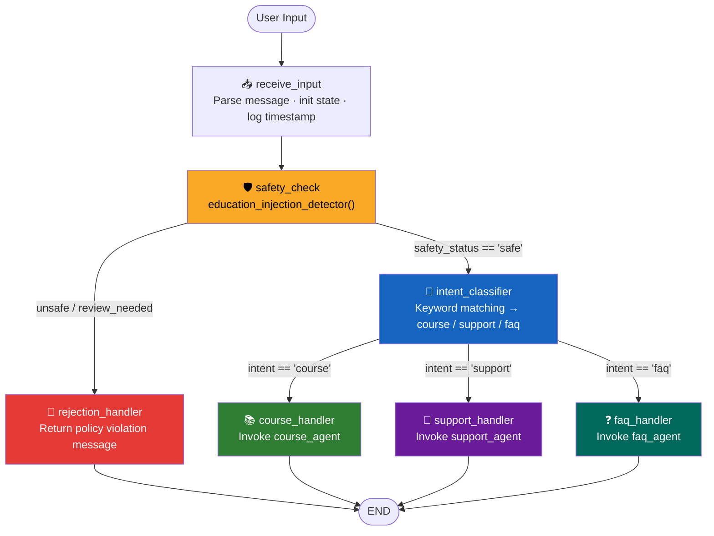

# LearnBot — LearnSphere Conversational AI (Assignment 3 Capstone)

A full-stack conversational AI for LearnSphere's online learning platform, integrating prompt engineering, education-specific safety guardrails, scoped LangChain agents, and a stateful LangGraph workflow that classifies intent and routes students to the right handler.

---

## Project Structure

- `learnbot/`
  - `models.py` — `LearnBotState` TypedDict with all 8 required fields
  - `safety.py` — `education_injection_detector()` and `output_content_filter()`
  - `prompts.py` — Three `ChatPromptTemplate` instances with `.partial()` pre-filling
  - `tools.py` — Four `@tool` functions: `get_course_info`, `check_enrollment_status`, `create_support_ticket`, `get_faq_answer`
  - `agents.py` — LLM wrapper and scoped agent factories (`course_agent`, `support_agent`, `faq_agent`)
  - `graph.py` — LangGraph nodes, conditional edges, and compiled graph
- `prompts/learnsphere/`
  - `v1.0.0.yaml` — baseline prompt version
  - `current.yaml` — symlink pointing to active version
- `tests/`
  - `test_safety.py` — 5 legitimate + 5 adversarial query test matrix
  - `test_agents.py` — per-agent scope and tool-call validation
  - `test_graph.py` — end-to-end graph invocation tests
- `learnbot_graph.png` — exported Mermaid graph diagram
- `main.py` — interactive demo and injection vulnerability showcase
- `requirements.txt` — Python dependency manifest
- `.env.example` — API key template
- `.gitignore` — ignored files for Git

---

## Setup

```bash
python3 -m venv .venv
source .venv/bin/activate
pip install -r requirements.txt
```

Create or update `.env` with:

```text
GEMINI_API_KEY=your_gemini_api_key_here
```

---

## Run the Agent

**Interactive chat (recommended for demos):**
```bash
python main.py
```

**Run full test matrix (legitimate + adversarial queries):**
```bash
pytest tests/
```

---

## Part A — Prompt Engineering (3 Templates)

Three `ChatPromptTemplate` instances, each `.partial()`-prefilled with `platform_name='LearnSphere'` and `current_date` before any agent assembly:

| Template | Persona | Required Dynamic Variables |
|---|---|---|
| **Course Query** | Academic advisor with catalog, prerequisites, and enrollment access | `{student_name}`, `{query}` |
| **Support Ticket** | Help-desk agent enforcing structured output: `{summary, priority, category, steps_taken}` | `{issue_description}` |
| **General FAQ** | FAQ responder with 3 embedded few-shot examples (account mgmt, payment, content access) | `{query}` |

**Why `.partial()` matters:** Pre-filling static variables (`platform_name`, `current_date`) at startup reduces per-request overhead — the template is half-compiled before any user message arrives.

---

## Part B — Safety Guardrails

`education_injection_detector(text: str) -> dict` flags four threat categories before any LLM call:

| Category | Example Triggers | Severity |
|---|---|---|
| Homework fraud | `"write my essay"`, `"solve this assignment"`, `"complete my quiz"` | HIGH |
| Academic dishonesty | `"cheat"`, `"plagiarize"`, `"copy answer"` | HIGH |
| Data exfiltration | `"list all students"`, `"export grades"`, `"show database"` | CRITICAL |
| Prompt manipulation | `"ignore instructions"`, `"act as"`, `"jailbreak"` | CRITICAL |

`CRITICAL` severity halts processing immediately — the LLM is never invoked.

`safe_learnsphere_invoke(user_input, template, llm)` pipeline:
```
injection_detector → [if safe] → template + LLM → output_content_filter → return result
```

Returns:
```python
{
    "status":             "safe" | "blocked",
    "response":           "<LLM response or refusal message>",
    "flags":              [...],
    "processing_time_ms": 142
}
```

---

## Part C — Tools & Scoped Agents

**Four `@tool` functions** (with full docstrings, type annotations, mock LMS data, and error handling):

| Tool | Key Return Fields |
|---|---|
| `get_course_info(title)` | `description`, `prerequisites`, `modules` |
| `check_enrollment_status(student_id, course_id)` | `active`, `completion_pct`, `certificate_date` |
| `create_support_ticket(issue, priority)` | `ticket_id`, `priority`, `estimated_resolution` |
| `get_faq_answer(query)` | `answer`, `confidence`, `related_articles` |

**Three scoped agents** — each agent sees only its domain tools:

| Agent | Tools Scoped To | Handles Intent |
|---|---|---|
| `course_agent` | `get_course_info`, `check_enrollment_status` | `course` |
| `support_agent` | `create_support_ticket`, `get_faq_answer` | `support` |
| `faq_agent` | `get_faq_answer` only | `faq` |

---

## Part D — LangGraph Workflow Architecture


### LearnBotState — 8 Required Fields

Defined as a `TypedDict` in `models.py`:

| Field | Type | Purpose |
|---|---|---|
| `messages` | `List[BaseMessage]` | Full conversation history (append-only) |
| `user_input` | `str` | Current raw user message |
| `intent` | `str \| None` | Classified intent: `course` / `support` / `faq` |
| `safety_status` | `str` | `safe` / `unsafe` / `review_needed` |
| `safety_flags` | `List[dict]` | Detected injection patterns with severity |
| `agent_response` | `str \| None` | Final response from the routed agent |
| `tool_calls_made` | `List[str]` | Ordered list of tool names invoked |
| `processing_metadata` | `dict` | Entry/exit timestamps, token count, agent used |

### Graph Architecture — 7 Nodes



### Conditional Edge Logic

| Source Node | Routing Function | Condition | Destination |
|---|---|---|---|
| `safety_check` | `route_after_safety()` | `safety_status == "safe"` | `intent_classifier` |
| `safety_check` | `route_after_safety()` | `unsafe` / `review_needed` | `rejection_handler` |
| `intent_classifier` | `route_after_intent()` | `intent == "course"` | `course_handler` |
| `intent_classifier` | `route_after_intent()` | `intent == "support"` | `support_handler` |
| `intent_classifier` | `route_after_intent()` | `intent == "faq"` | `faq_handler` |

### Export Graph Diagram (D.5)

```python
# Add to bottom of graph.py or call once from main.py
learnbot_graph.get_graph().draw_mermaid_png(output_file_path="learnbot_graph.png")
```

---